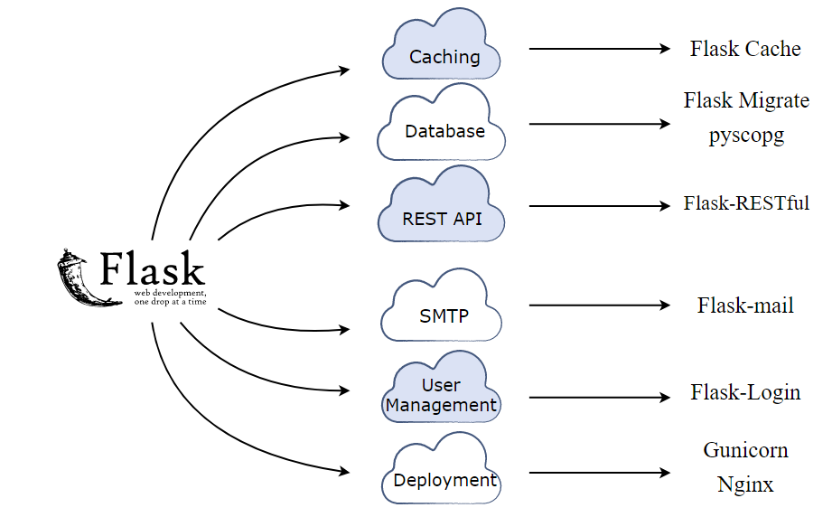

# Learning Flask Framework
  - **MTV** Architecture
  - **URL** Routes
  - Dynamic Routing
  - Usage of Static Templates
  - Usage of Static Files
  - Dynamic Templates with **Jinja**
  - Form Handling using **Flask-WTF**
  - Creating Models using **Flask-SQLAlchemy**
  - Operations on Models using **SQLAlchemy ORM**
## Packages you can explore

## References
- [Flask Cache](https://pythonhosted.org/Flask-Cache/) : For cache management in a **Flask** application.
- [Flask Migrate](https://flask-migrate.readthedocs.io/en/latest/) : Handles the **SQLAlchemy** database migrations for **Flask** applications using Alembic.
- [pyscopg](http://initd.org/psycopg/docs/) : To integrate **PostgreSQL** with your application.
- [Flask-RESTful](https://flask-restful.readthedocs.io/en/latest/) : Used for building **REST APIs** with Flask.
- [Flask-mail](https://pythonhosted.org/Flask-Mail/) : Provides support to set up **SMTP** with your Flask application.
- [Flask-Login](https://flask-login.readthedocs.io/en/latest/) : Provides an extension to efficiently manage user sessions, login, and logout.
- [Gunicorn](https://gunicorn.org/) : A **WSGI** (HTTP) web server that can be used to deploy Flask applications.
- [Nginx](https://www.nginx.com/) : Handles requests from the client in the deployment environment.

